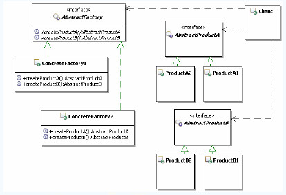
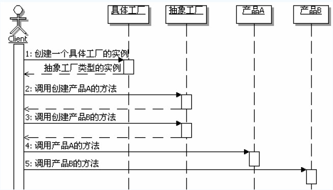

[TOC]

## 初识抽象工厂模式

### 定义

> 提供一个创建一系列相关或相关依赖对象的接口，而不需指定它们具体的类。
>
> 

### 结构和说明

AbstractFactory：抽象工厂，定义创建一系列产品对象的炒作接口。

ConcreateFactory：具体的工厂，实现抽象工厂定义的方法，具体实现一系列产品对象的创建。

AbstractProduct：定义一类产品对象的接口。

ConcreateProduct：具体的产品实现对象，通常在具体工厂里面，会选择具体的产品实现对象，来创建符合抽象工厂定义的方法返回的产品类型的对象。

Client：客户端，主要使用抽象工厂来获取一系列所需要的产品对象，然后面向这些产品对象的接口编程，以实现需要的功能。

## 认识抽象工厂模式

### 模式的功能

抽象工厂的功能是为一系列相关对象或相互依赖的对象创建一个接口。从某种意义上看，抽象工厂其实是一个产品系列，或者产品簇。

###实现成接口

`AbstractFactory`在`Java`中通常实现成为接口，不是实现成抽象类

### 使用工厂方法

`AbstractFactory`定义了创建产品所需要的接口，具体的实现是在实现类里面，通常在实现类里面就需要选择多种更具体的实现，所以`AbstractFactory`定义的创建产品的方法可以看成是工厂方法，而这些工厂方法的具体实现就延迟到了具体的工厂类里面，也就是说工厂方法来实现抽象工厂。

### 切换产品簇

抽象工厂定义了一个产品簇，因此切换产品簇的时候提供不同的抽象工厂（抽象工厂实现类）就好了

### 调用顺序图

### 优缺点

1. 分离接口和实现
2. 使得切换产品簇变得容易
3. 不太容易拓展新的产品
4. 容易造成层次复杂

## 思考抽象工厂模式

### 抽象工厂模式的本质

>  选择产品簇的实现

### 何时使用抽象工厂模式

1. 如果希望一个系统独立于它的产品的创建、组合和表示的时候，或者说，希望一个系统只是知道产品的接口，而不关心实现的时候
2. 如果一个系统要由多个产品系列中的一个来配制的时候，或者说，就是可以动态切换产品簇的时候
3. 如果要强调一系列相关产品的接口，以便联合使用它们的时候