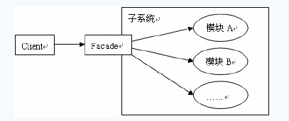
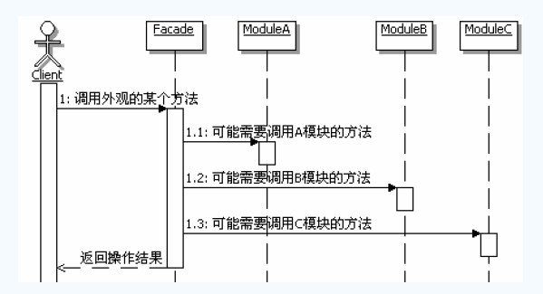
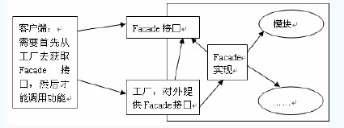

[TOC]

## 初识外观模式

### 定义

> 为子系统中的一组接口提供一个一致的界面，Facade模式定义了一个高层接口，这个接口使得这一子系统跟家容易使用。

### 结构和说明

Facade：定义子系统的多个模块对外的高层接口，通常需要调用内部多个模块，从而把客户的请求代理给适当的子系统对象。

模块：接收Facade对象的委派，真正实现功能，各个模块之间可能有交互。注意，facade对象知道各个模块，但是各个模块不应该知道Facade对象。

## 提供工厂方法模式

## 理解工厂方法模式

### 认识外观模式

#### 外观模式的目的

外观模式的目的不是给子系统添加新的功能接口，而是为了让外部减少与子系统内多个模块的交互，松散耦合，从而让外部能够更简单的使用子系统。

#### 使用外观与不适用有何变化

Facade方便了客户端的调用，封装了系统内部的实现细节，实现功能的复用和共享

#### 外观模式的调用顺序示意图

### 外观模式的实现

1. 把外观类当成一个辅助工具类实现

   

2. Facade可以实现称为interface。能够有选择性的暴露接口方法，尽量减少模块对子系统外提供的接口方法。

3. Facade的方法实现：Facade的方法实现中，一般是负责把客户端的请求转发给子系统内部的各个模块进行处理，Facade的方法本身不进行功能的处理，Facade的方法的实现只是实现了一个功能的组合调用。

### 外观模式的优缺点

- 松散耦合
- 简单易用
- 更好的划分访问层次
- 过多的或者是不太合理的Facade让人迷惑

## 思考外观模式

###  外观模式的本质

**封转交互，简化调用**

### 对设计模式的提现

体现了“**最少知识原则**”

### 何时选用外观模式

1. 如果系统为一个复杂的子系统提供一个简单接口的时候，可以考虑使用外观模式，使用外观对象来实现大部分客户端需要的功能，从而简化客户端的使用
2. 如果想要让客户端和抽象类的实现部分松散耦合，可以考虑使用外观模式，使用外观对象来将这个子系统与它的客户端分离开，从而提供子系统的独立性和可移植性
3. 如果构建多结构的系统，可以考虑使用外观模式，使用外观对象作为每层的入口，这样可以简化层间调用，也可以松散层次之间的依赖关系

