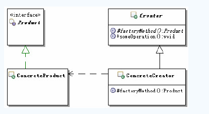
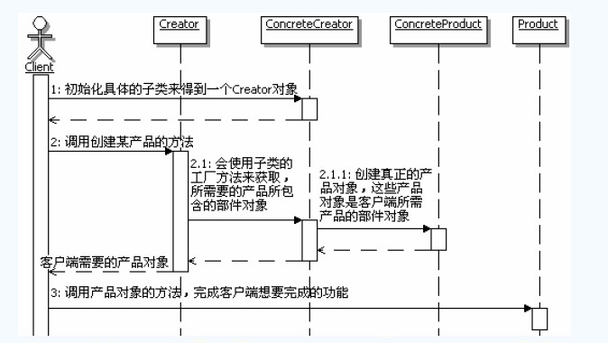

[TOC]

## 初始工厂方法模式

### 定义

> 定义一个用于创建对象的接口，让子类决定实例化哪一个类，工厂方法使一个类的实例化延迟到子类。

### 结构和说明

Product：定义工厂方法所创建的对象的接口，也就是实际需要使用的对象的接口

ConcreteProduct：具体的Product接口的实现对象

Creator：创建器，申明工厂方法

ConcreteCreator：具体的创建器对象，覆盖实现Creator定义的工厂方法，返回具体的Product实例

## 体会工厂方法模式

## 理解工厂方法模式

### 认识工厂方法模式

#### 工厂方法模式的功能

工厂方法的主要功能是让父类在不知道具体实现的情况下，完成自身的功能调用，而具体的实现延迟到子类来实现。

#### 实现成抽象类

工厂方法的实现中，通常父类会是一个抽象类，里面包含创建所需对象的抽象方法，这些抽象方法就是工厂方法

#### 实现成具体的类

把父类实现成为一个具体的类，这种情况下，通常是在父类中提供获取所需对象的默认实现方法，这样就算没有具体的子类，也能够运行

#### 工厂方法的参数和返回值

工厂方法的实现中，可能需要参数，以便决定到底选用哪一种具体的实现。一般工厂方法返回的是被创建对象的接口对象，当然也可以是抽象类或者一个具体的类的实例。

#### 谁来使用工厂方法创建的对象

在工厂方法模式里面，客户端要么使用`Create`对象，要么使用`Create`创建的对象，一般客户端不直接使用工厂方法。当然也可以直接把工厂方法暴露给客户端操作，但是一般不这么做。

#### 调用顺序图

#### 工厂方法模式与IoC/DI

##### 概念

- 依赖注入：应用程序依赖容器创建并注入它所需要的外部资源
- 控制反转：容器控制应用程序，由容器反向的向应用程序注入应用程序所需要的外部资源

##### 过程

在没有IoC/DI的时候，如果A类里面需要使用C，A就会主动创建C的对象

有了IoC/DI的时候，A类不主动创建C的对象，而是被动等待，等待IoC/DI的容器获取一个C的实例，然后反向的注入到A类中

##### 思想

其实IoC/DI对编程带来的最大改变不是从代码上，而是从思想上，发生了“主从换位”的变化。应用程序原本是老大，要获取什么资源都适合主动出击，但是在IoC/DI思想中，应用程序就变成被动的了，被动的等待IoC/DI容器来创建并注入它所需要的资源了。这么小小的改变其实是编程思想的一个大进步，这样就有效的分离了对象和它所需要的外部资源，使得它们松散耦合，有利于功能复用，更重要的事使得程序的整个体系结构变得非常灵活。

##### 工厂方法模式与Ioc/DI的关系

他们的思想很类似，都是“主动变被动”，进行“主从换位”，从而获得更灵活的程序结构。

#### 平行类层次结构

##### 概念

假如有两个类层次结构，其中一个类层次中的每个类在另一个类层次中都有一个对应的类的结构，就被称为平行的类层次结构。

##### 作用

主要用来把一个类层次中的某些行为分离出去，让类层次中的类把原本属于自己的职责，委托给分离出来的类去实现，从而使得类层次本身变得更简单，更容易扩展和复用。

#### 参数化工厂方法

通过给工厂方法传递参数，让工厂方法根据参数的不同来创建不同的产品对象

#### 工厂模式的优缺点

- 可以在不知具体实现的情况下编程
- 更容易扩展对象的新版本
- 链接平行的类层次
- 具体产品对象和工厂方法的耦合性

## 思考工厂方法模式

### 工厂方法模式的本质

工厂方法模式的本质是：**延迟到子类来选择实现**

#### 对设计原则的体现

工厂方法模式很好的体现了**依赖倒置原则**。依赖倒置原则告诉我们“要依赖抽象，不要依赖具体类”，简单点就是：不能让高层组件依赖于低层组件，而不管高层组件还是低层组件，都应该依赖于抽象

工厂方法模式与简单工厂都是通过工厂来创建对象，他们最大的不同是工厂方法模式在设计上更符合**开闭原则**

#### 何时选用工厂方法模式

- 如果一个类需要创建某个接口的对象，但是又不知道具体的实现，这种情况可以选用工厂方法模式，把创建对象的工作延迟到子类去实现
- 如果一个类本身就希望，由它的子类来创建所需的对象的时候，应该使用工厂方法模式

