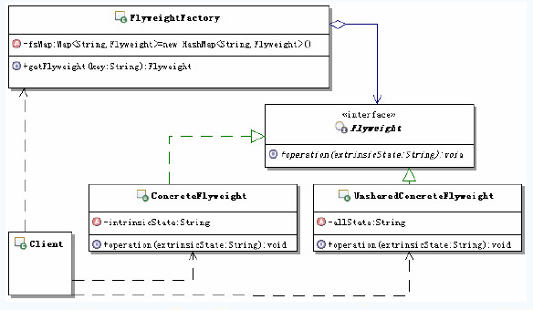
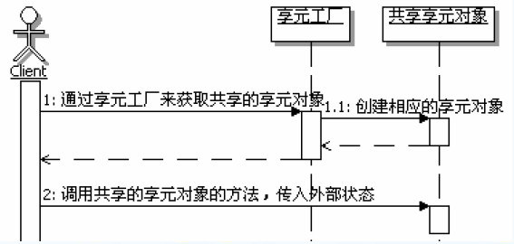

[TOC]

## 初始享元模式

### 定义

> 运用共享技术有效地支持大量细粒度对象的复用。系统只使用少量的对象，而这些对象都很相似，状态变化很小，可以实现对象的多次复用。由于享元模式要求能够共享的对象必须是细粒度对象，因此它又称为轻量级模式，它是一种对象结构型模式。享元模式结构较为复杂，一般结合工厂模式一起使用。

### 结构和说明

**Flyweight：**享元接口，通过这个接口flyweight可以接受并作用于外部状态。通过这个接口传入外部的状态，在享元对象的方法处理中可能会使用这些外部的数据。

**ConcreteFlyweight：**具体的享元实现对象，必须是可共享的，需要封装flyweight的内部状态。

**UnsharedConcreteFlyweight：**非共享的享元实现对象，并不是所有的flyweight实现对象都需要共享。非共享的享元实现对象通常是对共享享元对象的组合对象。

**FlyweightFactory：**享元工厂，主要用来创建并管理共享的享元对象，并对外提供访问共享享元的接口。

## 体会享元模式

## 理解享元模式

### 认识享元模式

#### 变与不变

享元模式设计的重点就在于分离变与不变，把一个对象的状态分成内部状态和外部状态，内部状态是不变的，外部状态是可变的。然后通过共享不变的部分，达到减少对象数量、并节约内存的目的。在享元对象需要的时候，可以从外部传入外部状态给共享的对象，共享对象会在功能处理的时候，使用自己内部的状态和这些外部状态。

#### 共享与不共享

在享元模式中，享元对象又有共享与不共享之分，这种情况通常出现在跟组合模式合用的情况，通常共享的是叶子对象，一般不共享的部分是由共享部分组合而成的，由于所有细粒度的叶子对象都已经缓存了，那么缓存组合对象就没有什么意义了。

#### 内部状态和外部状态

享元模式的内部状态，通常指的是包含在享元对象内部的、对象本身的状态，通常是独立于使用享元的场景的信息，一般创建过后就不再变化的状态，因此可以共享。

外部状态指的是享元对象之外的状态，取决于使用享元的场景，会根据使用场景而变化，因此不可共享。如果享元对象需要这些外部状态的话，可以从外部传递到享元对象里面，比如通过这个方法的参数来传递。

也就是说享元模式真正缓存和共享的数据是享元的内部状态，而外部状态是不应该被缓存共享的。

另外，内部状态和外部状态是独立的，外部状态的变化不应该影响到内部状态。

#### 实例池

在享元模式中，为了创建和管理共享的享元部分，引入了享元工厂，享元工厂中一般都包含有享元对象的实例池，享元对象就是缓存在这个实例池中的，实例池是缓存和管理对象实例的程序，通常保存到内存中（如Map）

#### 调用顺序图

享元模式的使用中，有两种情况，一种是没有“不共享”的享元对象，只有共享的享元对象；还有一种是既有共享享元对象，又有“不共享”的享元对象。

### 谁来初始化共享对象

在享元模式中，通常是在第一次向享元工厂请求获取共享对象的时候，进行共享对象的初始化，而且多半都是在享元工厂内部实现，不会从外部传入共享对象。当然可以从外部传入一些创建共享对象需要的值，享元工厂可以按照这些值去初始化需要共享的对象，然后把创建好的共享对象的实例放入享元工厂内部的缓存中。

### 享元模式的优缺点

1. 减少对象数量，节省累困空间，提升系统性能
2. 维护共享对象，需要额外开销
3. 使得系统变得复杂，需要分离出内部状态与外部状态，使得程序的逻辑复杂化

##思考享元模式

### 享元模式的本职

> 分离与共享

### 何时选用享元模式

1. 如果一个应用程序使用了大量的细粒度对象，可以使用享元模式来减少对象数量
2. 如果由于使用大量的对象，造成很大的存储开销，可以使用享元模式来减少对象数量，并节约内存
3. 如果对象的大多数状态都可以转变为外部状态，比如通过计算得到，或是从外部传入等，可以使用享元模式来实现内部状态和外部状态的分离
4. 如果不考虑对象的外部状态，可以用相对较少的共享对象取代很多组合对象，可以使用享元模式来共享对象，然后组合对象来使用这些共享对象

