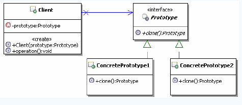
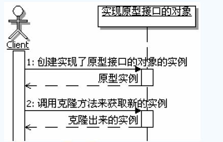

[TOC]

## 初始原型模式

### 定义

> 用原型实例指定创建对象的种类，并通过拷贝这些原型创建新的同类型对象。

### 结构和说明

**Prototype：**申明一个克隆自身的接口，用来约束想要克隆自己的类，要求他们都要实现这里定义的克隆方法。Prototype定义模板。

**ConcretePrototype：**实现Prototype接口的类，这些类真正实现克隆自身的功能。

**Client：**使用原型的客户端，首先要获取到原型实例对象，然后通过原型实例克隆自身来创建新的对象实例。

## 体会原型模式

## 理解原型模式

### 认识原型模式

#### 原型模式的功能

原型模式的功能实际上包含两个方面：

- 通过克隆来创建新的对象实例
- 为克隆出来的新的对象实例复制原型实例属性的值

原型模式要实现的主要功能就是：通过克隆来创建新的对象实例。一般来讲，新创建出来的实例的数据是和原型实例一样的。但是具体如何实现克隆，需要由程序自行实现，原型模式并没有统一的要求和实现算法。

#### 原型与new

原型模式从某种意义上说，就像是`new`操作，给出的示例代码中，克隆方法就是使用`new`来实现的，但是请注意，只是”类似于`new`“而不是”就是`new`“。

克隆方法和`new`操作最明显的不同就是在于：`new`一个对象实例，一般属性是没有值的，或者只有默认值；如果是克隆得到的一个实例，通常属性是有值的，属性的值就是原型对象实例在克隆的时候，原型对象实例的属性的值。

#### 原型实例和克隆的实例

原型实例和克隆出来的实例，本质上是不同的实例，克隆完成后，他们之间是没有关联的，如果克隆完成后，克隆出来的实例的属性的值发生了改变，是不会影响到原型实例的。

#### 原型模式的调用顺序示意图

#### java中的克隆的方法

在`Java`语言中已经提供了`clone`方法，定义在`Object`类中。需要克隆功能的类，只需要实现`java.lang.Cloneable`接口，这个接口没有需要实现的方法，是一个标识接口。

#### 浅度克隆和深度克隆

**浅度克隆：**只负责克隆按值传递的数据

**深度克隆：**除了浅度克隆要克隆的值外，还负责克隆引用类型的数据，基本上就是被克隆实例所有的属性的数据都会被克隆出来。

深度克隆还有一个特点，如果被克隆的对象里面的属性数据是引用类型，也就是属性的类型也是对象，那么需要一直递归的克隆下去。这也意味着，想要深度克隆成功，必须要整个克隆所涉及的对象都要正确实现克隆方法，如果其中有一个没有正确实现克隆，那么就会导致克隆失败。

#### 原型管理器

如果一个系统中原型的数据不固定，比如系统中的原型可以被动态的创建和销毁，那么就需要在系统中维护一个当前可用的原型注册表，这个注册表就被称为原型管理器。原型管理器就相当于一个缓存资源的实现，只不过里面缓存和管理的事原型实例而已。

有了原型管理器过后，一般情况下，除了向原型管理器里面添加原型对象的时候是通过`new`来创建的对象，其余的时候都是通过原型管理器来请求原型实例，然后通过克隆方法来获取新的对象实例，这样就可以动态管理、或者动态切换具体的实现对象实例。

简单的原型模式是客户端持有原型对象的引用，有原型管理器的原型模式是原型管理器持有原型对象的引用，原型管理器中的原型对象可以在不同的客户端中重复使用。

#### 原型模式的优缺点

- 对客户端隐藏具体的实现类型
- 在运行时动态改变具体的实现类型
- 深度克隆方法实现会比较困难

## 思考原型模式

### 原型模式的本质

> 克隆生成对象

### 何时选用原型模式

- 如果一个系统想要独立于它想要使用的对象时，可以使用原型模式，让系统只面向接口编程，在系统需要新的对象的时候，可以通过克隆原型来得到
- 如果需要实例化的类是在运行时刻动态指定时，可以使用原型模式，通过克隆原型来得到需要的实例。

Link:[掘金原型模式](https://juejin.im/post/5b48bec15188251b3d79bf9c)