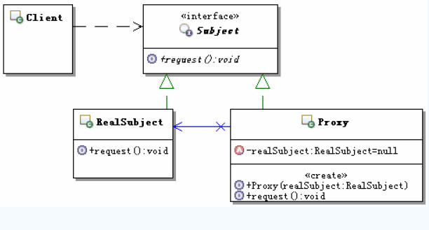
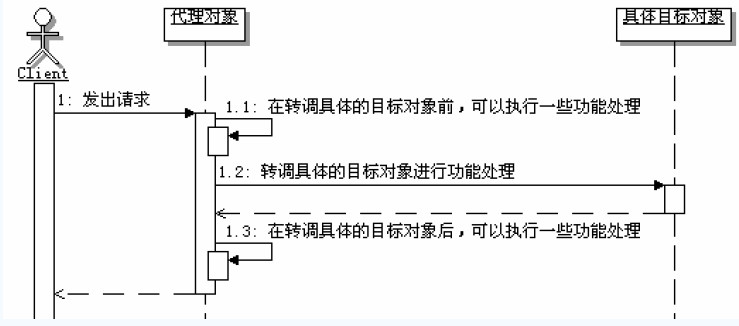

[TOC]

## 初识代理模式

### 定义

> 为其他对象提供一种代理以控制对这个对象的访问

### 结构和说明

Proxy：代理对象，通常具有如下功能：

1. 实现与具体的目标对象一样的接口，这样就可以使用代理来代替具体的目标对象
2. 保存一个指向具体目标对象的引用，可以在需要的时候调用具体的目标对象
3. 可以控制对具体目标对象的访问，并可能负责创建和删除它

Subjetc：目标接口，定义代理和具体目标对象的接口，这样就可以在任何使用具体目标对象的地方使用代理对象

RealSubject：具体的目标对象，真正实现目标接口要求的功能

## 理解代理模式

###认识代理模式

#### 代理模式的功能

代理模式是通过创建一个代理对象，用这个代理对象去代表真实的对象，客户端得到这个代理对象后，对客户端没有什么影响，就跟得到了真实对象一样来使用。

当客户端操作这个代理对象时，实际上功能最终还是会由真实的对象来完成，只不过是通过代理操作的，也就是客户端操作代理，代理操作真正的对象。

正是因为有代理对象夹在客户端和被代理的真实对象中间，相当于一个中转，那么在中转的时候就可以增加很多中间操作，如果判断权限。

#### 代理的分类

**虚代理：**根据需要来创建开销很大的对象，该对象只有在需要的时候才会被真正创建

**远程代理：**用来在不同的地址空间上代表同一个对象，这个不同的地址空间可以在本机，也可以在其他机器上，在Java里面最典型的就是`RMI`技术

**copy-on-write：**在客户端操作的时候，只有对象确实改变了，才会真正的拷贝一个目标对象

**保护代理：**控制对原始对象的访问，如果有需要，可以给不同的用户提供不同的访问权限，以控制他们对原始对象的访问

**智能指引：**在访问对象时执行一些附加操作，比如：对指向实际对象的引用计数

#### 具体目标和代理的关系

从代理模式的结构图来看，好像是有一个具体目标类就有一个代理类，其实不是这样的。如果代理类能完全通过接口来操作它所代理的目标对象，那么代理对象就不需要知道具体的目标对象，这样就无须为每个具体目标类都创建一个代理类了。

#### 代理模式的调用顺序示意图

###  保护代理

保护代理是一种控制对原始对象访问的代理，多用于对象应该有不同的访问权限的时候。保护代理会检查调用者是否具有请求所必须的访问权限，如果没有相应的权限，那么就不会调用目标对象，从而实现对目标对象的保护。

### Java中的代理

1. Java的静态代理

   通常把自己实现的代理模式，称为Java的静态代理。这种实现方式有一个较大的缺点，就是如果`Subject`接口发生变化，那么代理类和具体的目标实现类都要变化，不是很灵活。

2. Java的动态代理

   通常把使用Java内建的对代理模式支持的功能来实现的代理称为Java的动态代理。动态代理跟静态代理相比，明显的变化：静态代理实现的时候，在`Subject`接口上定义很多的方法，代理类里面自然也要实现很多方法；而动态代理实现的时候，虽然`Subject`接口上定义了很多方法，但是动态代理类始终只有一个`invoke`方法。这样当`Subject`接口发生变化的时候，动态代理的接口不需要跟着变化。

### 代理模式的优缺点

代理模式在客户和被客户访问的对象之间，引入了一定成程度的间接性，客户是直接使用代理，让代理来与被访问的对象进行交互。不同的代理类型，这种附加的间接性有不同的用途。

## 思考代理模式

### 代理模式的本质

> 控制对象访问

### 何时选用代理模式

1. 需要为一个对象在不同的地址空间提供局部代表的时候，可以使用远程代理
2. 需要按照需要创建开销很大的对象的时候，可以使用虚代理
3. 需要控制对原始对象的访问的时候，可以使用保护代理
4. 需要在访问对象的时候执行一些附加操作的时候，可以使用智能指引代理