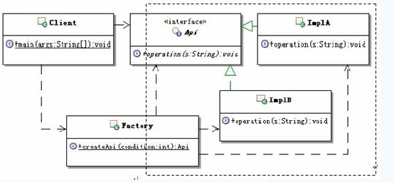
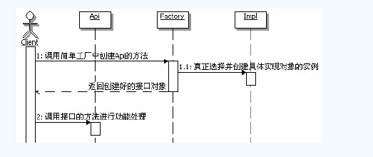

> 简单工厂不是一个标准的设计模式。简单工厂非常常用，简单而又神奇。

## 初始简单工厂

### 定义

提供一个创建对象实例的功能，而无须关心其具体实现。被创建实例的类型可以是接口、抽象类，也可以是具体的类。

### 结构和说明

# 

Api：定义客户端所需要的功能的接口、抽象类

Impl：具体实现Api的实现类，可能会有多个

Factory：工厂，选择合适的实现类来创建Api接口对象

Client：客户端，通过Factory去获取Api接口对象，然后面向Api接口编程

## 体会简单工厂

### 疑问

可能会有人问，简单工厂看起来不就是把客户端的`new Impl()`移动到简单工厂里面嘛？不还不是一样通过`new`一个实现类来得到接口嘛？把`new Impl()`这句话放到客户端和放到简单工厂里面有什么不同嘛？

**理解这个问题的重点就在于理解简单工厂所处的问题。**

## 理解简单工厂

### 简单工厂的功能

可以用来创建接口、抽象类或者普通类的实例

### 静态工厂

把简单工厂类实现成一个工具类，直接使用静态方法就可以了，也就是说简单工厂的方法通常都是静态的，所以也被被称为静态工厂

### 简单工厂创建对象的范围

建议控制在一个独立的组件级别或者一个模块级别

### 调用顺序示意图

### 简单工厂命名的建议

1. 类名建议为“模块名称 + `Factory`”，比如：用户模块的工厂（`UserFactory`）
2. 方法名称通常为“`get` + 接口名称”或者是“`create` + 接口名称”，不建议把方法名称命名为“`new` + 接口名称”

### 简单工厂中方法的写法

简单工厂方法的内部主要实现的功能是：**选择合适的实现类来创建实例对象**

**注意：**如果是客户端在调用工厂的时候，传入选择的参数，这就说明客户端必须知道每个参数的含义，也需要理解每个参数对应的功能处理。这就要求必须在一定程度上，想客户端暴露一定的内部实现细节。

### 可配置的简单工厂

使用反射加上配制文件，来实现添加新的实现类过后，无须修改代码，就能把这个新的实现类加入应用中

### 简单工厂的优缺点

- 帮助封装
- 解耦
- 可能增加客户端的复杂度
- 不方便扩展子工厂

## 思考简单工厂

### 简单工厂的本质

简单工厂的本质是：**选择实现**

### 合适选用简单工厂

1. 如果想要完全封装隔离具体实现，让外部只能通过接口来操作封装体，那么可以选用简单工厂，让客户端通过工厂来获取相应的接口，而无须关心具体实现。
2. 如果想要把对外创建对象的职责集中管理和控制，可以选用简单工厂，一个简单工厂可以创建很多的、不相关的对象，可以把对外创建对象的职责集中到一个简单工厂来，从而实现集中管理和控制。