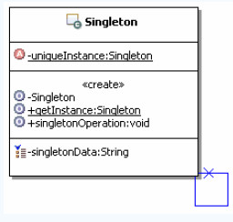
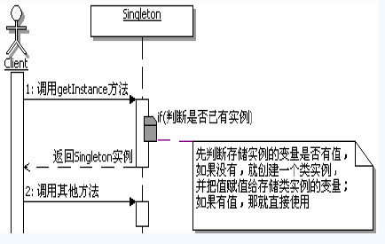
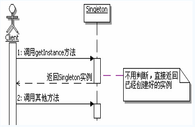

[TOC]

## 初识单例模式

### 定义

> 保证一个类仅有一个实例，并提供一个反问它的全局访问点

### 结构和说明

**Singleton：**负责创建`Singleton`类自己的唯一实例，并提供一个`getInstance`的方法，让外部来访问这个类的唯一实例。

## 理解单例模式

### 认识单例模式

1. 单例模式的功能

   单例模式的功能是用来保证这个类在运行期间只会被创建一个类实例，并提供一个全局唯一访问这个类实例的访问点

2. 单例模式的范围

   是一个`ClassLoader`及其子`ClassLoader`的范围

3. 单例模式的命名

   一般建议单例模式的方法命名为：getInstance()。

   

### 懒汉式与饿汉式

​															懒汉式调用顺序图

​															饿汉式调用顺序图

### 延迟加载

就是一开始不要加载资源或数据，一直等到马上就要使用这个资源或数据了才加载，这在实际开发中是一种很常见的思想，尽可能的节约资源。

### 缓存的思想

单例模式的懒汉式体现了缓存的思想。如果某些资源或者数据会被频繁的使用，可以把这些数据缓存到内存里面，每次操作的时候，先到内存里面找，如果有那么就直接使用，如果没有那么获取它并设置到缓存中，下一次访问的时候就可以直接从内存中获取了，从而节约大量的时间。

### 优缺点

1. 时间和空间：懒汉式是典型的时间换空间，饿汉式是典型的空间换时间

2. 线程安全：不加同步的懒汉式是线程不安全的，饿汉式是线程安全的。

   

### 双重检查加锁

并不是每次进入`getInstance`方法都需要同步，而是先不同步，进入方法过后，先检查实例是否存在，如果不存在才进入下面的同步块，这是第一重检查。进入同步快过后，再次检查实例是否存在，如果不存在，就在同步的情况下创建一个实例，这是第二重检查。这样依赖，在调用`getInstance`方法就只需要同步一次了，从而减少了多次在同步情况下进行判断所浪费的时间。

双重检查加锁机制的实现会使用一个关键字`volatile`，它是意思是：被`volatile`修饰的变量的值，将不会被本地线程缓存，所有对该变量的读写都是直接操作共享内存，从而确保多个线程能正确的处理该变量。

### 静态内部类单例

外部类加载时并不需要立即加载内部类，内部类不被加载则不执行初始化操作。即当`Singleton`第一次加载时，并不需要去加载`SingletonHolder`，只有当`getInstance()`方法第一次被调用时，才会导致虚拟机加载`SingletonHolder`类，这种方法不仅能确保线程安全，也能保证单例的唯一性，同时也是延迟加载。线程安全唯一性的原因：当`SingletonHolder`被加载的时候，`static`的属性会被初始化，而虚拟机加载初始化的过程是安全性的，`static`关键字保证了唯一性。

### 枚举单例

《Effective Java》

> 使用枚举实现单例的方法虽然还没有广泛采用，但是单元素的枚举类型已经成为实现Singleton的最佳方法

枚举编译后，枚举项用`static final`修饰，保证了只实例化一次，同时枚举是被final修饰的类不能被继承，构造器是`private`修饰不能被实例化，通过类加载机制来保证线程安全

## 思考单例模式

### 单例模式的本质

> 控制实例数目

### 何时选用单例模式

当需要控制一个类的实例只能有一个，而且客户端只能从一个全局访问点访问它时，可以选用单例模式。