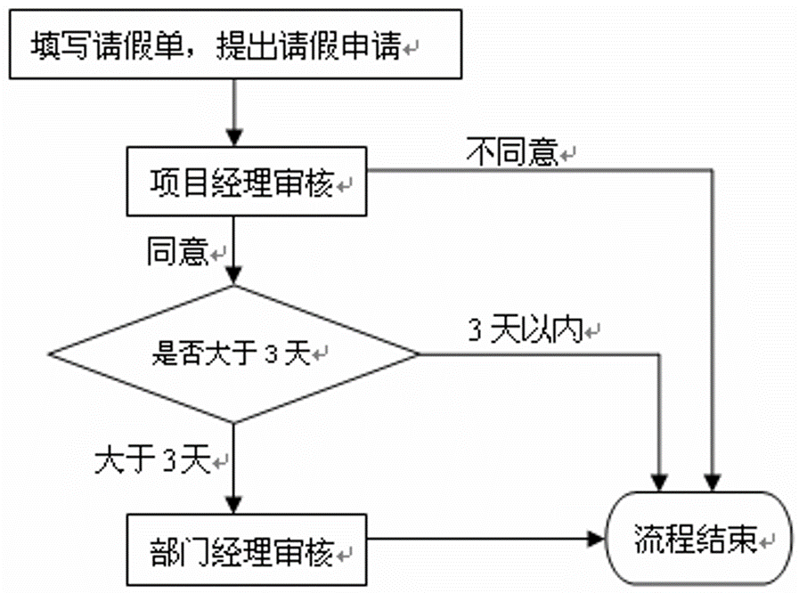

做企业应用的朋友，大多数都接触过工作流，至少处理过业务流程。当然 对于工作流，复杂的应用可能会使用工作流中间件，用工作流引擎来负责流程处理，这个会比较复杂，其实工作流引擎的实现也可以应用上状态模式，这里不去讨论。

简单点的，把流程数据存放在数据库里面，然后在程序里面自己来进行流 程控制。对于简单点的业务流程控制，可以使用状态模式来辅助进行流程控制， 因为大部分这种流程都是状态驱动的。

举个例子来说明吧，举个最常见的“请假流程”，流程是这样的：当某人 提出请假申请过后，先由项目经理来审批，如果项目经理不同意，审批就直接结 束；如果项目经理同意了，再看请假的天数是否超过3天，项目经理的审批权限 只有3天以内，如果请假天数在3天以内，那么审批也直接结束，否则就提交给部 门经理；部门经理审核过后，无论是否同意，审批都直接结束。流程图如图

