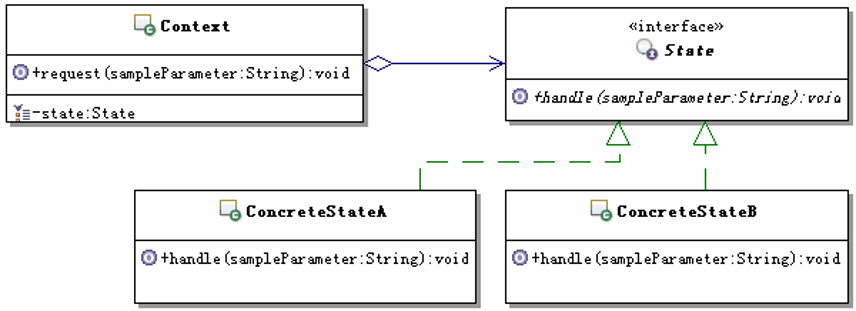
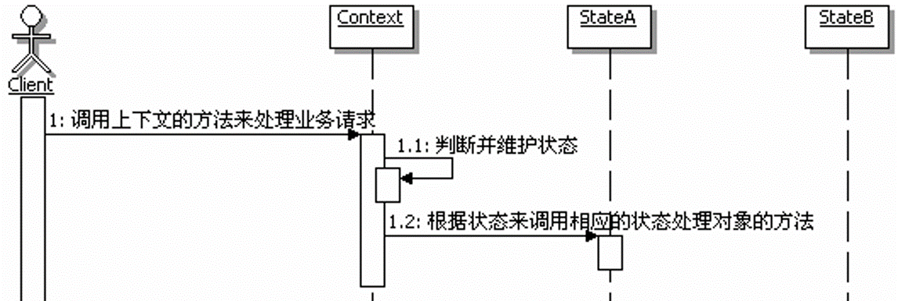
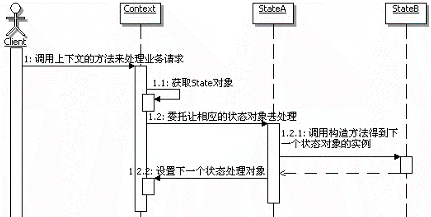

[TOC]

# 状态模式

## 初识状态模式

### 定义

> 允许一个对象在其内部状态改变时改变它的行为。对象看起来似乎修改了它的类。

### 结构




- Context：环境，也成为上下文，通常用来定义客户端感兴趣的接口，同时维护一个来具体处理当前状态的实例对象。
- State：状态接口，用来封装与上下文的一个特定状态所对应的行为。
- ConcreteState ：具体实现状态处理的类，每个类实现一个状态的具体处理。


### 参考实现


```
/**
 * 封装与Context的一个特定状态相关的行为
 */

@FunctionalInterface
public interface State {

    /**
     * 状态对应的处理
     */
    void handle(Object ... objs);
}
```

```
/**
 * 实现一个与Context的一个特定状态相关的行为
 */
public class ConcreteStateA implements State {

    @Override
    public void handle(Object... objs) {

    }
}
```

```
/**
 * 实现一个与Context的一个特定状态相关的行为
 */
public class ConcreteStateB implements State {

    @Override
    public void handle(Object... objs) {

    }
}
```


```
/**
 * 定义客户感兴趣的接口，通常会维护一个State类型的对象实例
 */
public class Context {

    /**
     * 持有一个State类型的对象实例
     */
    private State state;

    /**
     * 设置实现State的对象的实例
     * @param state 实现State的对象的实例
     */
    public void setState(State state) {
        this.state = state;
    }

    /**
     * 用户感兴趣的接口方法
     *
     * @param sampleParameter 示意参数
     */
    public void execute(String sampleParameter) {
        //在处理中，会转调state来处理
        state.handle(sampleParameter);
    }
}
```


## 体会状态模式

### 场景问题

考虑一个在线投票的应用，要实现控制同一个用户只能投一票，如果一个用户反复投票，而且投票次数超过5次，则判定为恶意刷票，要取消该用户投票的资格，当然同时也要取消他所投的票。如果一个用户的投票次数超过8次，将进入黑名单，禁止再登录和使用系统。


### 不使用状态模式的解决方案

代码：`com.beisiji.design_pattern.state.example1`


**存在的问题：**
1. 如果要修改某种投票情况所对应的具体功能处理，那就需要在那个大代码块中，找到相应的代码块，然后进行改动。
2. 如果要添加新的功能，比如投票超过8次但不足10次的， 给个机会，只是禁止登录和使用系统3天，如果再犯，才永久封掉账号，该怎么办呢？那就需要改动投票管理的源代码，在上面的`if-else`结构中再添加一个`else-if`块进行处理。


### 使用状态模式的解决方案


**思路：**

那几种用户投票的类型，就相当于是描述了人员的几种投票状态，而各个状态和对应的功能处理具有很强的对应性，有点类似于“一个萝卜一个坑”，各个状态下的处理基本上都是不一样的，也不存在可以相互替换的可能。

为解决上面的问题，很自然的一个设计就是首先把状态和状态对应的行为从原来的大代码中分离出来，把每个状态所对应的功能处理封装在一个独立的类里面，这样选择不同处理的时候，其实就是在选择不同的状态处理类。

要修改某种投票情况所对应的具体功能处理，那就是直接修改或者扩展某个状态处理类的功能就可以了。而要添加新的功能就更简单，直接添加新的状态处理类就可以了，当然在使用`Context`的时候，需要设置使用这个新的状态类的实例。


## 理解状态模式

### 认识状态模式

- 状态和行为

  - 状态，通常指的就是对象实例的属性的值

  - 行为，指的就是对象的功能，再具体一点，行为多半可以对应到方法上。


    状态模式的功能就是分离状态的行为，通过维护状态的变化，来调用不同的状态对应的不同的功能。也就是说，状态和行为是相关联的，他们的关系可以描述为：状态决定行为。由于状态是运行期被改变的，因此行为也会在运行期，根据状态的改变而改变，看起来同一个对象在不同的运行时刻，行为是不一样的，就像是类被修改了一样。

- 行为的平行性

  所谓平行性指的的各个状态的行为所处的层次是一样的，相互是独立的、没有关联的，是根据不同的状态来决定到底走平行线的那一条，行为是不同的，当然对应的实现也是不同的，相互之间不可替换。

  ```
  平等性强调的是可替换性，是同一行为的不同描述或实现，因此在同一个行为发生的时候，可以根据条件来挑选任意一个实现来进行相应的处理。
  
  状态模式和策略模式结构基本相同，但是他们的目的、实现、本质不一样。行为之间的特性是状态模式和策略模式的很重要的区别：状态模式的行为是平行性的，不可相互替换的；而策略模式的行为是平等性的，是可以相互替换的。
  ```

- 上下文和状态处理对象

  在状态模式中，上下文是持有状态的对象，但是上下文本身并不处理跟状态相关的行为，而是把处理状态的功能委托给了状态对应的状态处理类来处理。

  在具体的状态处理类里面经常需要获取上下文自身的数据，甚至在必要的时候回调上下文的方法，通常上下文自身当做一个参数传递给具体的状态处理类。

  客户端一般只和上下文交互，客户端可以用状态对象来配制上下文（初始状态），一旦配制完毕，就不再需要和状态对象交互了，客户端通常不负责运行期间状态的维护，也不负责决定到底后续使用哪一个具体的状态处理对象。

- 调用顺序图

  

### 状态模式的维护和转换控制

- **状态的维护**，指的就是维护状态的数据，就是给状态设置不同的状态值
- **状态的转换**，指的就是根据状态的变化来选择不同的状态处理对象


在状态模式中，通常有两个地方进行状态的维护和转换控制

1. **上下文**，因为状态本身通常被实现为上下文的对象的状态，因此可以在上下文里面进行状态维护，当然也就可以控制状态的转换，之前的投票代码就是采用这种方式。
2. **状态的处理类**，当每个状态处理对象处理完自身状态所对应的功能后，可以根据需要指定后继的状态，让应用能正确处理后续的请求。


**如何选用哪种状态维护模式**

如果状态转换的规则是一定的，一般不需要进行什么拓展规则，那么就适合在上下文中统一惊喜状态的维护（在上下文中进行维护，如果添加了新的状态，改动的地方比较多）；如果状态的转换取决于前一个状态动态处理的结果，为了增强灵活性，一般是在状态处理类进行状态的维护。


采用让状态对象来维护和转换状态的调用顺序图




### 状态模式的优缺点

1. 简化应用逻辑控制
2. 更好的分离状态和行为
3. 更好的扩展性
4. 现实化进行状态转换，状态模式对不同的状态使用不同的对象，状态的转换更加明确
5. 引入太多的状态类

## 思考状态模式

### 状态模式的本质

> 根据状态来分离和选择行为

### 何时选用

1. 如果一个对象的某个行为取决于它的状态，而且它必须在运行时刻根据状态来改变它的行为。可以使用状态模式，来把状态和行为分离开，虽然分离开了，但状态和行为是有对应关系的，可以在运行期间，通过改变状态，就能够调用到该状态对应的状态处理对象上去，从而改变对象的行为。
2. 如果一个操作中包含大量的分支语句，而且这些分支语句依赖于对象的状态。可以使用策略模式，把各个分支的处理分散到单独的对象处理类里面，这样这些分支对应的对象就可以不依赖于其他对象而独立变化。


